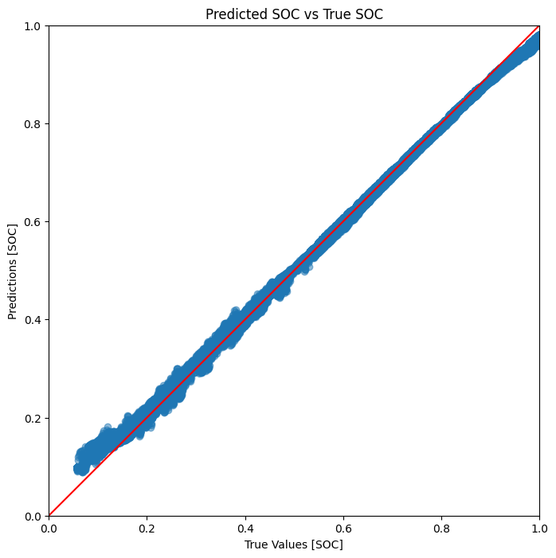
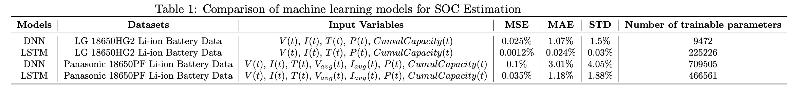
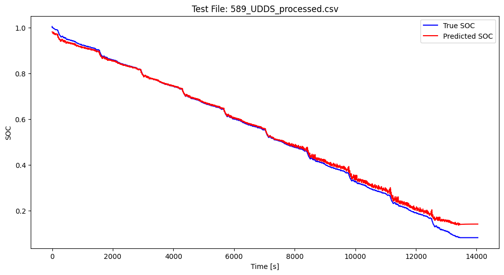

# Battery State of Charge (SoC) Estimation using Machine Learning

This project focuses on estimating the State of Charge (SoC) of lithium-ion batteries using **Deep Neural Networks (DNN)** and **Long Short-Term Memory (LSTM)** models. Two publicly available datasets were used for training and evaluation:  
- **LG 18650HG2 Li-ion Battery Data** ([Link](https://data.mendeley.com/datasets/cp3473x7xv/3))  
- **Panasonic 18650PF Li-ion Battery Data** ([Link](https://data.mendeley.com/datasets/wykht8y7tg/1))  

## Repository Structure  
├── data_processing/                # Data preprocessing scripts and analyse  
│   ├── lg/                         # Processing for LG dataset
│   ├── panasonic/                  # Processing for Panasonic dataset (+ MAT to CSV conversion)  
│  
├── datasets/                       # Processed and raw datasets  
│   ├── LG/  
│   │   ├── raw/                    # Raw LG data  
│   │   ├── parsed/                 # Parsed LG data  
│   │   └── precessed/              # Processed LG data  
│   │  
│   └── Panasonic/  
│       ├── raw/                    # Raw Panasonic data  
│       ├── parsed/                 # Parsed Panasonic data  
│       └── processed/              # Processed Panasonic data
│  
├── training_and_testing/           # Model training and evaluation  
│   ├── for_lg_data/                # DNN & LSTM trained on LG data (+ weights)  
│   └── for_panasonic_data/         # DNN & LSTM trained on Panasonic data (+ weights)  
│  
├── inference/                      # Models testing on custom data  
│  
├── plots/                          # Performance comparison plots  
│  
└── README.md  


## Datasets  
### LG 18650HG2 Dataset  
- **Temperature range**: -20°C, -10°C, 0°C, 10°C, 25°C, **40°C**  
- **Driving cycles**: Various dynamic profiles (US06, UDDS, HPPC, etc.)

### Panasonic 18650PF Dataset  
- **Temperature range**: -20°C, -10°C, 0°C, 10°C, 25°C  
- **Driving cycles**: Different discharge/charge profiles (LA92, NN, HWFET, etc.)

## Models & Training  
Two neural architectures were implemented:  
1. **DNN (Deep Neural Network)**  
   - Tuned hyperparameters: `num_layers`, `hidden_size`, `dropout`, `learning_rate`  
2. **LSTM (Long Short-Term Memory)**  
   - Tuned hyperparameters: `num_layers`, `hidden_size`  

### Evaluation Metrics  
- **Mean Squared Error (MSE)**  
- **Mean Absolute Error (MAE)**  
- **Standard Deviation (STD)**  

## Results  
### 1. True vs. Predicted SoC  
  

### 2. Model Performance Comparison  


### 3. DNN model on LG test data  
  

**Key Observations**:  
- LSTM outperforms DNN due to its ability to capture temporal dependencies
- Both models show higher errors at extreme temperatures (e.g., -20°C)

## Usage  
1. **Preprocessing**: Run scripts in `data_processing/` to convert raw data
2. **Training**: Execute notebooks in `training_and_testing/`
3. **Inference**: Use scripts in `inference/` to test models on new data

## Installation  
```bash
pip install -r requirements.txt