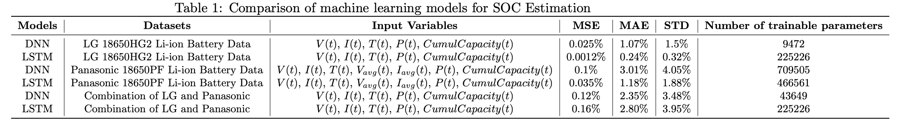

# Battery State of Charge (SoC) Estimation using Machine Learning

This project focuses on estimating the State of Charge (SoC) of lithium-ion batteries using **Deep Neural Networks (DNN)** and **Long Short-Term Memory (LSTM)** models. Two publicly available datasets were used for training and evaluation:  
- **LG 18650HG2 Li-ion Battery Data** ([Link](https://data.mendeley.com/datasets/cp3473x7xv/3))  
- **Panasonic 18650PF Li-ion Battery Data** ([Link](https://data.mendeley.com/datasets/wykht8y7tg/1))  

## Repository Structure  
- `data_processing/`: Data preprocessing scripts and analyse
- `datasets/`: Processed and raw datasets
- `training_and_testing/`: Model training and evaluation
- `inference/`: Models testing on custom data  
- `plots/`: Performance comparison plots  
- `README.md`
- `requirements.txt`  


## Datasets  
### LG 18650HG2 Dataset  
- **Temperature range**: -20°C, -10°C, 0°C, 10°C, 25°C, **40°C**  
- **Driving cycles**: Various dynamic profiles (US06, UDDS, HPPC, etc.)

### Panasonic 18650PF Dataset  
- **Temperature range**: -20°C, -10°C, 0°C, 10°C, 25°C  
- **Driving cycles**: Different discharge/charge profiles (LA92, NN, HWFET, etc.)

## Models & Training  
Two neural architectures were implemented:  
1. **DNN (Deep Neural Network)**  
   - Tuned hyperparameters: `num_layers`, `hidden_size`, `dropout`, `learning_rate`  
2. **LSTM (Long Short-Term Memory)**  
   - Tuned hyperparameters: `num_layers`, `hidden_size`  

### Evaluation Metrics  
- **Mean Squared Error (MSE)**  
- **Mean Absolute Error (MAE)**  
- **Standard Deviation (STD)**  

## Results  
### 1. True vs. Predicted SoC  
  
**Pic1: A DNN trained on LG dataset.**

  
**Pic2: A LSTM trained on LG dataset.**

  
**Pic3: A DNN trained on Panasonic dataset.** 

  
**Pic4: A LSTM trained on Panasonic dataset.**

### 2. Qualitative comparison with true labels  

**Pic5: UDDS cycle, 0degC, DNN model trained on LG dataset**


**Pic6: US06 cycle, -20degC, LSTM model trained on LG dataset**


**Pic7: LA92 cycle, 25degC, DNN model trained on Panasonic dataset**


**Pic8: US06 cycle, 25degC, LSTM model trained on Panasonic dataset**

### 3. Model Performance Comparison  


### 4. Testing of Panasonic data on a DNN/LSTM models that were trained on an LG dataset


### 5. Testing of LG data on a DNN/LSTM models that were trained on a Panasonic dataset


**Computational complexity of the models**:
| Model  | Dataset   | KFLOPs  |
|:-------|:----------|:--------|
|  DNN   |   LG      | 17      |
| LSTM   |   LG      | 445     |
| DNN    |  Panasonic| 1429    |
| LSTM   | Panasonic |  924    |

**Key Observations**:  
- LSTM outperforms DNN due to its ability to capture temporal dependencies
- Both models show higher errors at extreme temperatures (e.g., -20°C)

## Usage  
1. **Preprocessing**: Run scripts in `data_processing/` to convert raw data
2. **Training**: Execute notebooks in `training_and_testing/`
3. **Inference**: Use scripts in `inference/` to test models on new data

## Installation  
```bash
pip install -r requirements.txt